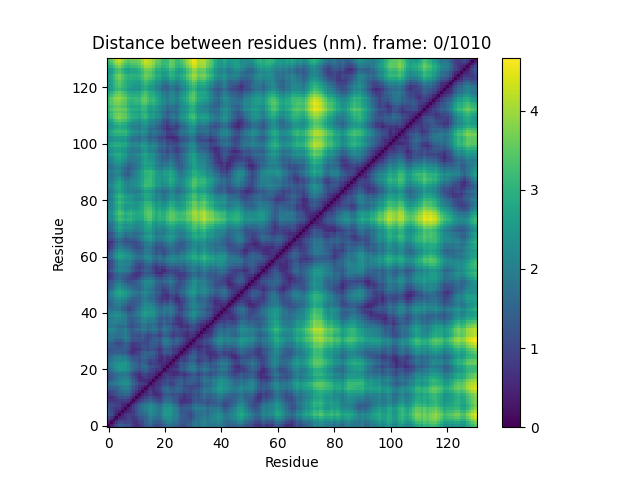
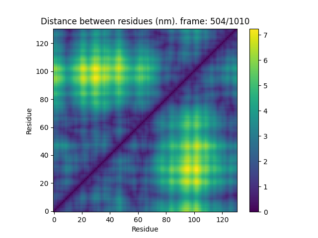
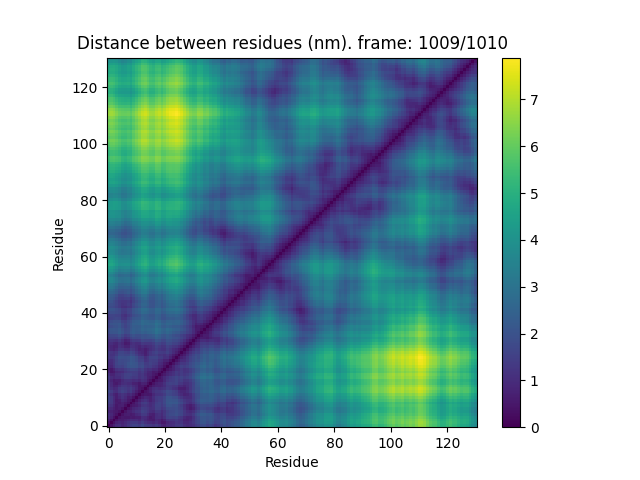

# A1-LCD* Simulation (70.7 ns)

**Environment**
- `box` = [50,50,50] nm
- `temp` = 273 K,
- `pH` = 7.5,
- `ionic` = 0.19

**Contact Map**: Distance between residues

 

To see how the map evolve in time [Watch the video](https://user-images.githubusercontent.com/contact_map.mp4)